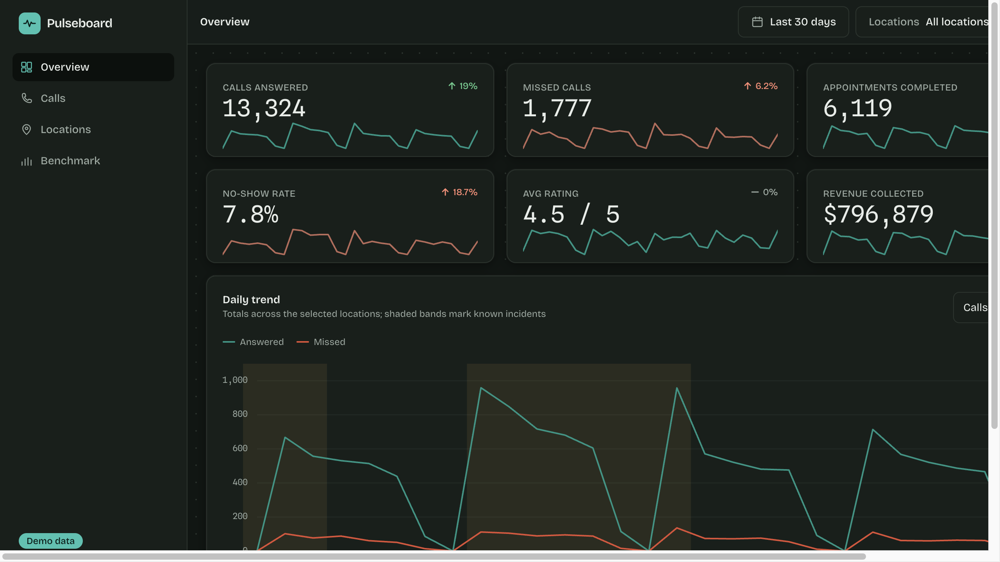
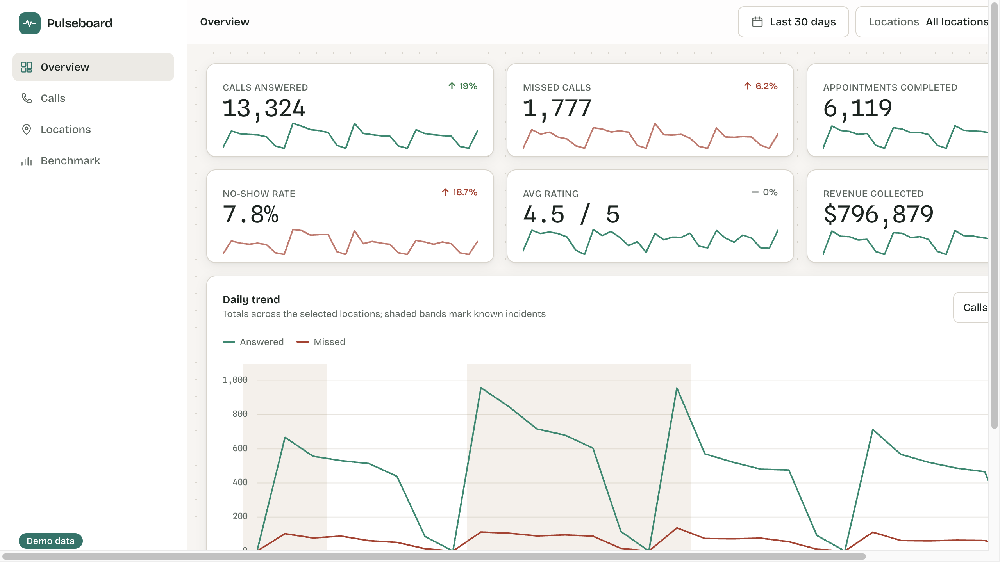
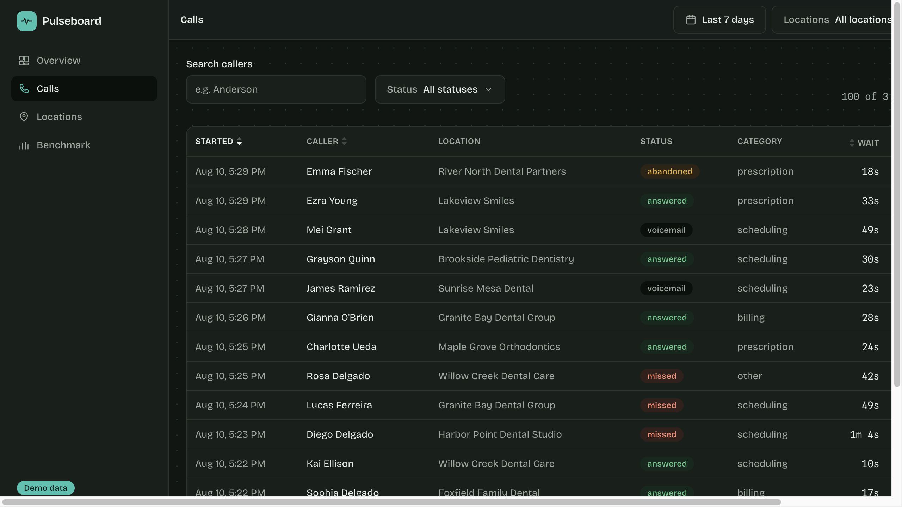
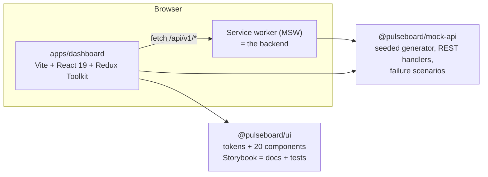

# Pulseboard

**Operations analytics for multi-location clinics — a production-grade frontend showcase.**

Every number in it is generated: Pulseboard ships with a seeded, deterministic mock
backend instead of a server, because the point of this repository is the frontend
craft around it — a tokenized design system, Storybook as a tested contract, an
error architecture you can watch working, and a CI gate where green means shippable.


**Live demo:** [pulseboard-green-chi.vercel.app](https://pulseboard-green-chi.vercel.app) ·
**Design system:** [pulseboard-storybook.vercel.app](https://pulseboard-storybook.vercel.app) ·
try the [failure-mode demo](https://pulseboard-green-chi.vercel.app/?apiScenario=degraded) or the
[50k-row benchmark](https://pulseboard-green-chi.vercel.app/benchmark/table)



<details>
<summary>Light theme and the calls explorer</summary>




</details>

## Highlights

- **Semantic-token design system** on Tailwind 4 with the default palette wiped —
  `bg-blue-500` is a build error. Light and dark ship together; every token pair is
  WCAG-audited by a unit test and chart hues passed a color-vision-deficiency check.
- **Storybook is the component test suite**: every story renders in headless Chromium
  in CI, play functions drive keyboard traversal and focus management, and axe
  violations fail the build.
- **An error architecture you can demo**: a topbar menu flips the mock API into
  slow/degraded/outage modes — per-widget boundaries, retries with backoff, a
  degraded banner over cached data, and designed empty states all react live.
- **52,555-row virtualized table** with server-driven sorting and infinite scroll;
  the in-app benchmark page measures it (64.7 ms mount, ~30 rows in the DOM,
  10.2 ms p95 frame). Details in [docs/performance.md](docs/performance.md).
- **Deterministic to the digit**: the seeded dataset makes "13,324 calls answered"
  an exact Cypress assertion, and the Calls table always reconciles with the
  Overview tiles because daily metrics are aggregated from the same records.
- **Sub-5-minute CI** that blocks on typecheck, lint, format, 260+ tests, coverage
  thresholds, bundle budgets, both builds, and nine end-to-end specs.

## Architecture



- **`packages/ui`** — design tokens, ~20 components, Storybook with a11y gating.
- **`packages/mock-api`** — domain model, deterministic data generator with
  anomaly storylines, RESTful MSW handlers shared by dev, tests, Storybook and
  Cypress, plus latency/failure scenario presets.
- **`apps/dashboard`** — the product: Overview, Calls, Locations, and a
  performance benchmark page. RTK Query owns server state; slices own global
  filters (URL-synced) and API health.

Decisions with trade-offs are recorded in [docs/adr](docs/adr).

## Getting started

```bash
pnpm install
pnpm dev              # dashboard on http://localhost:5173
pnpm storybook        # design system on http://localhost:6006
```

Useful URLs: `/?apiScenario=degraded` boots into the failure demo;
`/?datasetEndDate=2026-08-10` pins the dataset tests assert against;
`/benchmark/table` runs the render benchmark on your machine.

## Scripts

| Command                                        | What it does                                                 |
| ---------------------------------------------- | ------------------------------------------------------------ |
| `pnpm test`                                    | every Vitest project, including stories in headless Chromium |
| `pnpm test:unit`                               | mock-api, ui and dashboard suites (jsdom/node)               |
| `pnpm test:storybook`                          | stories as tests: render + play functions + axe              |
| `pnpm test:coverage`                           | unit suites with thresholds on `packages/ui`                 |
| `pnpm test:e2e`                                | production build served, nine Cypress specs                  |
| `pnpm size`                                    | bundle budgets (ratchets, enforced in CI)                    |
| `pnpm lint` / `pnpm typecheck` / `pnpm format` | the usual gates                                              |

## Testing

| Tier                       | Tooling                                   | Where it lives                                                                       | Gate              |
| -------------------------- | ----------------------------------------- | ------------------------------------------------------------------------------------ | ----------------- |
| Unit — pure logic          | Vitest (node/jsdom)                       | generator determinism, WCAG token audit, reducers, selectors, transforms             | `quality`         |
| Behavioural — user-visible | Testing Library + MSW (jsdom)             | pages render exact seeded totals, per-widget failure isolation, URL sync             | `quality`         |
| Behavioural — real browser | Storybook play functions + axe (Chromium) | keyboard traversal, focus return, selection flows, every story renders               | `storybook-tests` |
| Smoke — critical path      | Cypress against the production build      | boot with exact values, filters, deep links, sorting, outage recovery, mobile drawer | `e2e`             |

Two details worth calling out: the mock API's daily metrics are **aggregated from
the same call records** the table pages serve, so cross-page reconciliation is a
tested invariant, not a hope; and the seeded PRNG streams are keyed per
`(location, metric family, date)`, so adding a metric never reshuffles existing data.

## Design system

Foundations, component docs and the living contrast audit are in Storybook
(`pnpm storybook`). The short version: semantic tokens only, `data-theme` stamped
pre-paint by an inline script, numbers always in tabular-nums mono, focus styles
owned globally, and a deliberately pruned inventory — no Toast, no Breadcrumbs,
nothing a three-page dashboard doesn't need.

## Honest limitations

- The data is fiction, generated in the browser; MSW ships in the production
  bundle by design and costs ~40 KB (ADR-0002).
- There is no auth, no persistence and no server — out of scope for a frontend
  showcase.
- Coverage thresholds apply to `packages/ui`'s jsdom run; three interaction-only
  components are covered by the browser-mode story tests instead (ADR-0004).

## License

MIT © Ashwani Arya
